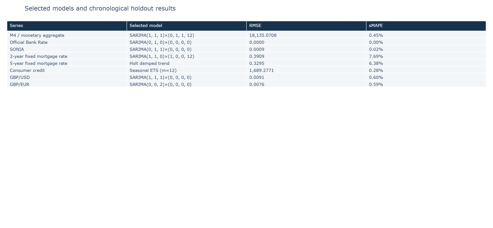

# EconLens: UK Economic Time-Series Forecasting

EconLens compares baseline, exponential-smoothing and SARIMA forecasts across eight Bank of England time series. It demonstrates chronological evaluation, transparent candidate comparison, forecast uncertainty and residual diagnostics.

The project uses the same source series as UK Economic Data Pipeline & Analytics but answers a different question: the pipeline project focuses on preparing and exploring data; EconLens focuses on statistical forecasting.



## Forecasting workflow

`native-frequency preparation → chronological split → training-only ADF check → baseline/model fitting → holdout comparison → selected-model refit → forecasts → residual diagnostics`

## Models and metrics

Candidates include naïve, seasonal-naïve, drift, damped Holt, seasonal ETS and a deliberately limited SARIMA grid. Models are ranked by RMSE, then MAE and sMAPE on one chronological model-selection holdout.

This is not an untouched final test set: the holdout is used to choose the winning model. Reported values therefore compare candidates on that period and are not unbiased guarantees of future performance.

## Dataset

| Code | Indicator | Frequency used | Horizon |
|---|---|---:|---:|
| LPMAUYN | M4 / monetary aggregate | Monthly | 12 months |
| IUDBEDR | Official Bank Rate | Business daily | 30 business days |
| IUDSOIA | SONIA | Business daily | 30 business days |
| IUMBV34 | 2-year fixed mortgage rate | Monthly | 12 months |
| IUMBV42 | 5-year fixed mortgage rate | Monthly | 12 months |
| LPMVZRI | Consumer credit | Monthly | 12 months |
| XUDLUSS | GBP/USD | Business daily | 30 business days |
| XUDLERS | GBP/EUR | Business daily | 30 business days |

## Interpretation

- ADF testing guides non-seasonal differencing but is not proof that every model assumption holds.
- The candidate grid is intentionally small and interpretable rather than exhaustive.
- SARIMA intervals are model-derived; other model families use approximate residual-based prediction bands.
- Ljung–Box non-rejection means autocorrelation was not detected at the tested lag, not that residuals are proven independent.
- The Bank Rate's saved zero holdout error occurs because the 30-day holdout was unchanged; it does not show that policy decisions are predictable.
- The saved GBP/EUR result retains significant residual autocorrelation and should be treated cautiously.
- Monthly models have relatively short histories, especially consumer credit.

## Query interface

The optional `ask_econlens` helper is deterministic keyword and regular-expression routing. It selects an existing series and forecast horizon and formats stored model output. It is not an LLM, semantic assistant or causal economic model.

## Repository structure

```text
notebooks/  Main forecasting notebook
data/raw/   Bank of England CSV inputs
outputs/    Generated leaderboards, diagnostics and forecasts
images/     Selected portfolio screenshots after the final run
```

## Run locally

1. Create and activate a Python 3.11 or 3.12 environment.
2. Install dependencies with `pip install -r requirements.txt`.
3. Confirm that the eight included CSV files are present in `data/raw/`.
4. Start Jupyter from the repository root.
5. Restart the kernel and run the notebook from top to bottom.
6. Inspect fitting warnings and candidate statuses before publishing outputs. The run regenerates the result tables and portfolio images.

## Limitations

- One chronological holdout is weaker than rolling-origin evaluation.
- The holdout is used for both model selection and reported comparison metrics.
- Candidate orders are manually constrained and do not constitute exhaustive tuning.
- Business-day indexes do not encode every UK market or bank holiday.
- Statistical forecasts do not model policy decisions, causal mechanisms or unexpected shocks.
